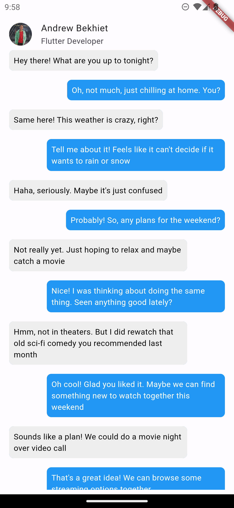
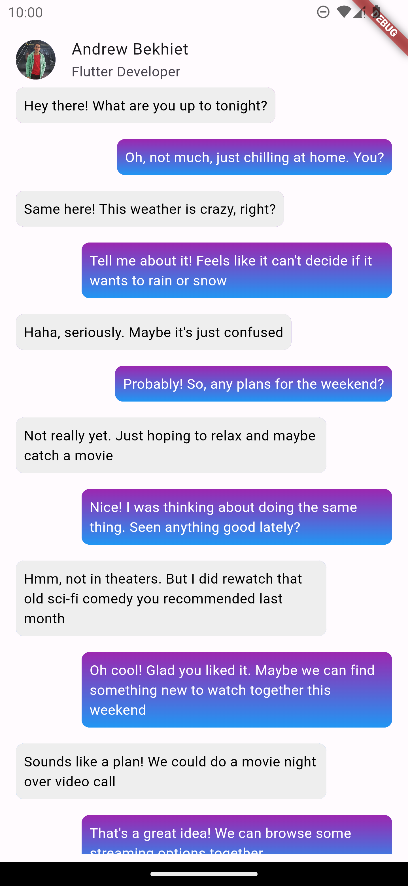

# Flutter Chat UI with messenger gradient style

Have you ever looked at the Facebook Messenger chat screen and wondered how they achieved that gradient effect on the chat bubbles?

A couple of days ago, I did, and I thought it would be a good idea to try to replicate that effect in Flutter

This is what we are going to build


## Create new flutter project

So let's start by creating a new Flutter project by running in terminal

```bash
flutter create messenger_gradient_demo
```

This will create a new empty project

Remove all the comments and the counter app code, keep only the MainApp widget, and make `home` property point to a new ChatScreen widget

```dart
import 'package:flutter/material.dart';
import 'package:messenger_gradient_demo/pages/chat.dart';

void main() {
  runApp(const MainApp());
}

class MainApp extends StatelessWidget {
  const MainApp({super.key});

  @override
  Widget build(BuildContext context) {
    return const MaterialApp(
      home: ChatScreen(),
    );
  }
}
```

## Chat Screen

Now, let's create the Chat Screen by creating a new file at `lib/pages/chat.dart` with the following code

```dart
import 'package:flutter/material.dart';
import 'package:messenger_gradient_demo/models/message.dart';
import 'package:messenger_gradient_demo/widgets/message_bubble.dart';
import 'package:messenger_gradient_demo/widgets/user_info_tile.dart';

class ChatScreen extends StatefulWidget {
  const ChatScreen({super.key});

  @override
  State<ChatScreen> createState() => _ChatScreenState();
}

class _ChatScreenState extends State<ChatScreen> {
  final List<Message> messages = [
    Message(
      text: "Hey there! What are you up to tonight?",
      senderIsMe: false,
    ),
    Message(
      text: "Oh, not much, just chilling at home. You?",
      senderIsMe: true,
    ),
    // Other messages...
  ];

  @override
  Widget build(BuildContext context) {
    return Scaffold(
      body: Padding(
        padding: const EdgeInsets.only(bottom: 8, left: 8, right: 8),
        child: ListView.builder(
          itemCount: messages.length,
          reverse: true,
          itemBuilder: (context, index) {
            final Message message = messages.reversed.elementAt(index);

            return ListTile(title: Text(message.text))
          },
        ),
      ),
    );
  }
}
```

We've added a `Scaffold` widget, which 'scaffolds' any screen in flutter (although the name refers to its shape and design, but that's another story)

And the body of this scaffold is some padding then a ListView which will display the messages

Using ListView.builder makes sure that every message is lazily built, which means Flutter will render the widget in the list only when it's visible on the screen

And we are using the `reversed` property of the List to make the list start from bottom and continue to the top, which means you would naturally scroll from bottom to top to see the messages

This also requires that we reverse the order of the messages in the list, so that the first message is the last one in the list (top) and the last message is the first one in the list (bottom)

You might get confused, why would we reverse the list and then reverse it again in the ListView.builder?

Think of it this way: The normal order of the list is from top to bottom, but would you read the very first message at the top of the screen, and then scroll miles down to read the last message? No (unless you invented a new way of reading messages), you would scroll from bottom to top to read the messages, so we reverse the ListView.builder to make the scrolling start from bottom to top

But if you stop here, you would see the first message at the bottom of the screen, that's why we reverse the messages list

Still confused? Try to run the app with only one of the 2 revere methods and see what happens...

## User Info

If you run now, you would feel something is missing... Of course we need a user info app bar, so let's create a new file `lib/widgets/user_info_tile.dart`

```dart

import 'package:flutter/material.dart';

class UserInfo extends StatelessWidget {
  final String name;
  final String? subtitle;

  const UserInfo({super.key, required this.name, this.subtitle});

  @override
  Widget build(BuildContext context) {
    return ListTile(
      title: Text(name),
      subtitle: subtitle != null ? Text(subtitle!) : null,
    );
  }
}
```

UserInfo takes the name and subtitle of the user, and displays them in a ListTile widget

The UserInfo still needs a user image, let's add the `leading` property to the `ListTile` widget, I will use a CircleAvatar widget with background color

Now UserInfo needs the imageUrl of the user, let's add this

```dart
import 'package:flutter/material.dart';

class UserInfo extends StatelessWidget {
  final String name;
  final String? subtitle;
  final String imageUrl;

  const UserInfo({
    super.key,
    required this.name,
    this.subtitle,
    required this.imageUrl,
  });

  @override
  Widget build(BuildContext context) {
    final ThemeData theme = Theme.of(context);

    return ListTile(
      leading: CircleAvatar(
        backgroundColor: theme.colorScheme.primary,
        foregroundImage: NetworkImage(imageUrl),
      ),
      title: Text(name),
      subtitle: subtitle != null ? Text(subtitle!) : null,
    );
  }
}
```

Now we can put this UserInfo widget in the ChatScreen AppBar

Using flexibleSpace property, we can add a widget that will have the same height as the AppBar

Adding a SafeArea widget to avoid the user image to be hidden by the system status bar

```dart
  Widget build(BuildContext context) {
    return Scaffold(
      appBar: AppBar(
        flexibleSpace: const SafeArea(
          child: UserInfo(
            name: 'Andrew Bekhiet',
            subtitle: 'Flutter Developer',
            imageUrl: 'https://avatars.githubusercontent.com/u/40571928',
          ),
        ),
      ),
      body: Padding(
        padding: const EdgeInsets.only(bottom: 8, left: 8, right: 8),
        child: ListView.builder(
          itemCount: messages.length,
          reverse: true,
          itemBuilder: (context, index) {
            final Message message = messages.reversed.elementAt(index);

            return MessageBubble(message);
          },
        ),
      ),
    );
  }
```

## Message Bubble

Now the part that you've been waiting for, the message bubble widget!

The MessageBubble widget will be responsible for displaying the message in a bubble, with different colors for the sender and the receiver

Let's create a new file `lib/widgets/message_bubble.dart`

```dart
import 'package:flutter/material.dart';
import 'package:messenger_gradient_demo/models/message.dart';

class MessageBubble extends StatelessWidget {
  const MessageBubble(this.message, {super.key});

  final Message message;

  @override
  Widget build(BuildContext context) {
    final MediaQueryData mediaQuery = MediaQuery.of(context);

    return Align(
      alignment:
          message.senderIsMe ? Alignment.centerRight : Alignment.centerLeft,
      child: ConstrainedBox(
        constraints: BoxConstraints(maxWidth: mediaQuery.size.width * 0.80),
        child: Container(
          margin: const EdgeInsets.all(8.0),
          padding: const EdgeInsets.all(8.0),
          decoration: BoxDecoration(
            color: message.senderIsMe ? Colors.blue : Colors.grey[200],
            borderRadius: BorderRadius.circular(8.0),
          ),
          child: Text(
            message.text,
            style: TextStyle(
              color: message.senderIsMe ? Colors.white : Colors.black,
            ),
          ),
        ),
      ),
    );
  }
}
```

MessageBubble takes the Message object, then depending on the senderIsMe property, it will align the message to the right or left of the screen using `Align` widget and change the color of the message bubble with the `decoration` property of the `Container` widget

You can notice that I've added a ConstrainedBox to the Container, this is to limit the width of the message bubble to 80% of the screen width

Now we need to add the Message model, let's create a new file `lib/models/message.dart`

```dart
class Message {
  final String text;
  final bool senderIsMe;

  const Message({required this.text, required this.senderIsMe});
}
```

## Add some mock messages

I will ask [Gemini](https://gemini.google.com) to generate some mock messages for testing

> Generate random chat messages between two persons.
> The messages must use the following format:
> Message(text: '{message text content}', senderIsMe: {whether the sender is first user or not})

Now let's add these messages to our chat screen, in real app you would get these messages from an API, but that's another story

```dart
  final List<Message> messages = [
    Message(
      text: "Hey there! What are you up to tonight?",
      senderIsMe: false,
    ),
    Message(
      text: "Oh, not much, just chilling at home. You?",
      senderIsMe: true,
    ),
    Message(
      text: "I'm going to the movies with some friends",
      senderIsMe: false,
    ),
    Message(
      text: "That sounds fun! I wish I could join you",
      senderIsMe: true,
    ),
    Message(
      text: "Yeah, it's been a while since we last met",
      senderIsMe: false,
    ),
    Message(
      text: "I know, I miss you",
      senderIsMe: true,
    ),
    Message(
      text: "I miss you too",
      senderIsMe: false,
    ),
    Message(
      text: "I'm going to the movies with some friends",
      senderIsMe: true,
    ),
    Message(
      text: "That sounds fun! I wish I could join you",
      senderIsMe: false,
    ),
    Message(
      text: "Yeah, it's been a while since we last met",
      senderIsMe: true,
    ),
    Message(
      text: "I know, I miss you",
      senderIsMe: false,
    ),
    Message(
      text: "I miss you too",
      senderIsMe: true,
    ),
  ];
```

This is what we have so far:



### The gradient effect

Let's add the gradient effect to the bubbles

```dart
@override
  Widget build(BuildContext context) {
    final MediaQueryData mediaQuery = MediaQuery.of(context);

    return Align(
      alignment:
          message.senderIsMe ? Alignment.centerRight : Alignment.centerLeft,
      child: ConstrainedBox(
        constraints: BoxConstraints(maxWidth: mediaQuery.size.width * 0.80),
        child: Container(
          margin: const EdgeInsets.all(8.0),
          padding: const EdgeInsets.all(8.0),
          decoration: BoxDecoration(
            color: message.senderIsMe ? Colors.blue : Colors.grey[200],
            gradient: message.senderIsMe
                ? const LinearGradient(
                    colors: [Colors.purple, Colors.blue],
                    stops: [-1, 1],
                    begin: Alignment.topCenter,
                    end: Alignment.bottomCenter,
                  )
                : null,
            borderRadius: BorderRadius.circular(8.0),
          ),
          child: Text(
            message.text,
            style: TextStyle(
              color: message.senderIsMe ? Colors.white : Colors.black,
            ),
          ),
        ),
      ),
    );
  }
```

Wait, what's that?


The gradient is not working as we expected, this is because the gradient is being applied only to the current widget bounds, meaning it can't be applied to the whole screen

### The gradient effect v2

We need to think of another way...

Let's see how Facebook Messenger did it...

Reading [this section](https://css-tricks.com/recreating-the-facebook-messenger-gradient-effect-with-css) from css-tricks.com, we can see that the gradient is applied to the whole screen, then other elements are added around to hide it

We can do the same effect in flutter, but with a different approach

Instead to creating white elements to hide the gradient, we will use a combination of BlendModes

Specifically, we will use the `dstOut` BlendMode to make the opaque message bubble transparent on opaque background,
then we will use `srcOut` to make the message bubble surrounding background white and make the message bubble transparent

You can play with different BlendModes to achieve different effects and understand how they work

So let's add the gradient background to the whole screen:

```dart
@override
Widget build(BuildContext context) {
  return Scaffold(
    appBar: AppBar(
      flexibleSpace: const SafeArea(
        child: UserInfo(
          name: 'Andrew Bekhiet',
          subtitle: 'Flutter Developer',
          imageUrl: 'https://avatars.githubusercontent.com/u/40571928',
        ),
      ),
    ),
    body: Padding(
      padding: const EdgeInsets.only(bottom: 8, left: 8, right: 8),
      child: DecoratedBox(
        decoration: const BoxDecoration(
            gradient: LinearGradient(
          colors: [Colors.purple, Colors.blue],
          begin: Alignment.topCenter,
          end: Alignment.bottomCenter,
        )),
        child: ListView.builder(
          itemCount: messages.length,
          reverse: true,
          itemBuilder: (context, index) {
            final Message message = messages.reversed.elementAt(index);

            return MessageBubble(message);
          },
        ),
      ),
    ),
  );
}
```

Now we need to add the masking effect to the message bubble

But let's first extract the message content to a separate widget

```dart
class _MessageContent extends StatelessWidget {
  final Message message;
  final bool isTransparent;

  const _MessageContent({
    required this.message,
    this.isTransparent = false,
  });

  @override
  Widget build(BuildContext context) {
    final MediaQueryData mediaQuery = MediaQuery.of(context);

    return Align(
      alignment:
          message.senderIsMe ? Alignment.centerRight : Alignment.centerLeft,
      child: ConstrainedBox(
        constraints: BoxConstraints(maxWidth: mediaQuery.size.width * 0.80),
        child: Container(
          margin: const EdgeInsets.all(8.0),
          padding: const EdgeInsets.all(8.0),
          decoration: BoxDecoration(
            color: isTransparent
                ? null
                : message.senderIsMe
                    ? Colors.blue
                    : Colors.grey[200],
            borderRadius: BorderRadius.circular(8.0),
          ),
          child: Text(
            message.text,
            style: TextStyle(
              color: message.senderIsMe ? Colors.white : Colors.black,
            ),
          ),
        ),
      ),
    );
  }
}
```

You can see that I've added a new property `isTransparent` to the _MessageContent widget, to make the widget transparent when needed in the masking effect

Now let's add the masking effect to the message bubble:

```dart
@override
Widget build(BuildContext context) {
  final ThemeData theme = Theme.of(context);

  return Stack(
    children: [
      // Use ClipRect to avoid applying the masking effect to the whole screen
      ClipRect(
        // Use ColorFiltered to apply the masking effect
        // This will paint [theme.scaffoldBackgroundColor] only on background area of the bubble and discard transparent pixels
        child: ColorFiltered(
          colorFilter: ColorFilter.mode(
            theme.scaffoldBackgroundColor,
            BlendMode.srcOut,
          ),
          child: DecoratedBox(
            // This makes the area occupied by the bubble transparent on a black background
            decoration: const BoxDecoration(
              color: Colors.black,
              backgroundBlendMode: BlendMode.dstOut,
            ),
            // This is used to determine the shape of the masking effect
            // notice that the message content is not transparent to make dstOut work properly
            child: _MessageContent(message: message),
          ),
        ),
      ),
      // This is the actual message content that is displayed at the end
      // It has transparent background when the sender is the current user, to show the gradient behind it
      _MessageContent(
        message: message,
        isTransparent: message.senderIsMe,
      )
    ],
  );
}
```

And that's it!


You can find the full code on [GitHub](https://github.com/Andrew-Bekhiet/messenger_gradient_demo)

Do you think it could be implemented in a different or a better way? Let me know in the comments!

I hope you enjoyed this tutorial, and learned something new
